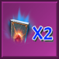
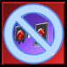
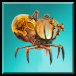

# BigOlBagOfMutators

New Custom mutators for the game Monster Train.

## Installing.

Installation is handled through [steam workshop](https://steamcommunity.com/sharedfiles/filedetails/?id=2964979662)

## Mutators List

| Mutator                                                                                               | Description                                                                                                           | Notes                                                                                                                                                                             | DLC Required | Version   |
|:-----------------------------------------------------------------------------------------------------:|:--------------------------------------------------------------------------------------------------------------------- |:--------------------------------------------------------------------------------------------------------------------------------------------------------------------------------- | ------------ | --------- |
|  **Apex of all Imps** | Replaces your champion with **Champion** Apex Imp.                                                                    | Recommended to have Hellhorned as a primary or secondary clan. As the champion paths depend on having imps in your deck or armor generation.                                      | Yes          | 1.0       |
|  **Blank Book**                                                      | Remove the Champion from your starting deck. Start with Blank Book.                                                   | Blank book is an artifact that works like Blank Pages, giving you a Champion if you don't have one in your hand. The champion paths are appropriate for whatever ring you are in. | Yes          | 1.0       |
| **Boomerang**                                                            | All spells gain Holdover                                                                                              |                                                                                                                                                                                   | No           | 2.0       |
|  **Erratic Reflection**                                         | Start with Chaotic Reflection.                                                                                        | Chaotic Reflection: Cards in reward packs and unit banners come with all upgrade slots prefilled. Upgrades can be (almost all) Cavern / Divine Temple / Shop upgrades             | Yes          | 1.1 / 2.0 |
|  **Feeling Bloated**                                            | When any spell card is played, a copy of the spell card is added to your discard pile.                                |                                                                                                                                                                                   | No           | 2.0       |
|  **Foreign Goods**                                                | Merchant of Steel sells all upgrades regardless of Clan.                                                              |                                                                                                                                                                                   | No           | 2.0       |
|  **Jack of All Trades**                                        | Your champion can only select an upgrade path once.                                                                   |                                                                                                                                                                                   | No           | 1.1       |
|  **Made of Glass**                                                 | All units get [fragile] and [damageshield] 1. Bosses have additional [damageshield]. Piercing is removed.             |                                                                                                                                                                                   | No           | 1.0       |
|  **No Eternalstone**                                            | Eternalstone no longer appears in Merchant of Magic.                                                                  |                                                                                                                                                                                   | No           | 2.0       |
|  **No Freezestone**                                              | Freezestone no longer appears in Merchant of Magic.                                                                   |                                                                                                                                                                                   | No           | 2.0       |
|  **No Frenzystone**                                              | Frenzystone no longer appears in Merchant of Steel.                                                                   |                                                                                                                                                                                   | No           | 2.0       |
|  **No Immortalstone**                                          | Immortalstone no longer appears in Merchant of Steel.                                                                 |                                                                                                                                                                                   | No           | 2.0       |
|  **No Keepstone**                                                  | Keepstone no longer appears in Merchant of Magic.                                                                     |                                                                                                                                                                                   | No           | 2.0       |
|  **No Largestone**                                                | Largestone no longer appears in Merchant of Steel.                                                                    |                                                                                                                                                                                   | No           | 2.0       |
|  **No Speedstone**                                                | Speedstone no longer appears in Merchant of Steel.                                                                    |                                                                                                                                                                                   | No           | 2.0       |
|  **No Stackstone**                                                | Stackstone no longer appears in Merchant of Magic.                                                                    |                                                                                                                                                                                   | No           | 2.0       |
|  **Pyrebond**                                                         | Deal 1 damage to the Pyre whenever a friendly unit takes damage. <b>Pyre Remains</b> restores twice the usual amount. |                                                                                                                                                                                   | No           | 1.0       |
|  **Scripted Page**                                                | Remove the Champion from your starting deck. Start with Scripted Page.                                                | Scripted Page gives you a random champion (appropriately upgraded) at the start of battle.                                                                                        | Yes          | 1.0       |
|  **Stampede!**                                                        | All units get <b>Trample</b>                                                                                          |                                                                                                                                                                                   | No           | 2.0       |
|  **The Colony**                                                         | Replaces Train Stewards with Spikedriver Colony with +5 attack and +5 health.                                         | The associated Heph Cavern Event is excluded from appearing in this mutator, meaning the Spikedriver Colony units will continue replicating.                                      | No           | 2.0       |
|  **Vine Grandmother**                                          | Replaces your champion with <b>Champion</b> Vinemother.                                                               |                                                                                                                                                                                   | No           | 2.0       |
|  **We're All Robots**                                            | Friendly Units enter with <b>Inert</b> and '<b>Incant</b>: Gain <b>Fuel 1</b>'                                        |                                                                                                                                                                                   | No           | 2.0       |

## Champion Mutators

###  Apex of All Imps

#### Champion Upgrades

##### Protective

This upgrade allows Apex Imp to counter attack whenever an Imp unit on the floor is damaged dealing damage equal to some proportion of Apex Imp's armor.

###### Protective I

**Armor 5** and Deals damage equal to half of Apex Imp's armor

###### Protective II

**Armor 15** and Deals damage equal to Apex Imp's armor

###### Protective III

**Armor 25** and Deals damage equal to two times Apex Imp's armor

##### Rousing

This upgrade applies rage to all imps in the room whenever Apex Imp takes damage

###### Rousing I

**Armor 5** and **Revenge**: Apply **Rage 3** to all imps in the room.

###### Rousing II

**Armor 10** and **Revenge**: Apply **Rage 5 **to all imps in the room.

###### Rousing III

**Armor 15** and **Revenge**: Apply **Rage 8** to all imps in the room.

##### Light Armor

This upgrade just gives Apex Imp fragile for exchange for multistrike.

###### Light Armor I

Armor 5 and **Multistrike 1**

###### Light Armor II

**Armor 10** and **Multistrike 2**

###### Light Armor III

**Armor 15** and **Multistrike 3**
